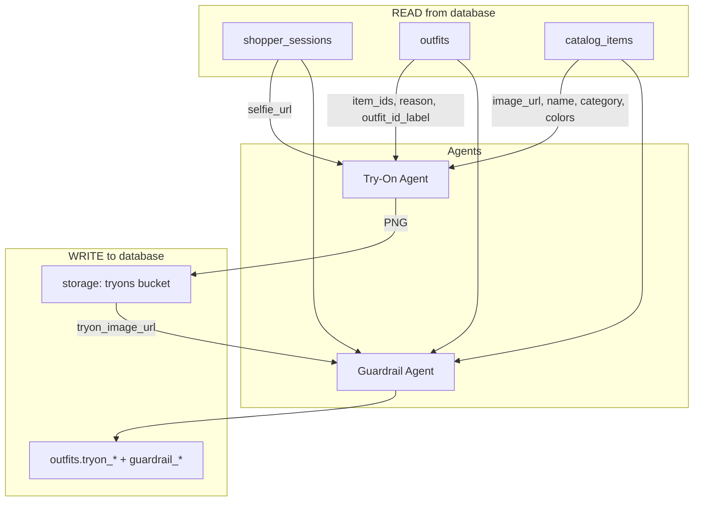

# Database Handoff: Try-On & Guardrail Agents

**Audience:** Database / backend engineer wiring Supabase/Postgres to the agent pipeline  
**Owner:** Agent testing (Try-On Visualization + Guardrail)  
**Related:** try-on agent testing plan (Cursor plan: `try-on_agent_testing`), [`backend/models.py`](../backend/models.py), [`tests/fixtures/`](../tests/fixtures/)

---

## Summary

Two agents run in sequence during a styling session:

1. **Try-On Visualization Agent** (`gemini-3.1-flash-image-preview`) — customer photo + catalog garment image → generated try-on PNG
2. **Guardrail Agent** (`gemini-3.5-flash`) — compares customer photo, garment references, and generated try-on → structured pass/fail JSON

Both agents are **read-heavy** on catalog + session/outfit data, and **write back** try-on URLs and guardrail results. The backend orchestrator resolves DB rows into the multimodal payloads; agents never query the DB directly.

---

## Pipeline (what the backend loads from DB)



---

## Tables involved

### Already exist (see `backend/models.py`)

| Table | Agent use |
|-------|-----------|
| `catalog_items` | Garment reference images + metadata for try-on prompt and guardrail comparison |
| `shopper_sessions` | Customer photo (`selfie_url`) and session context |
| `outfits` | Recommendation bundle: which catalog items, reason, ranking |

### Needs to be added (for production wiring)

The `outfits` table does **not** yet store try-on or guardrail outputs. Add:

| Column | Type | Nullable | Notes |
|--------|------|----------|-------|
| `tryon_image_url` | `TEXT` | YES | Public/S3 URL of generated try-on PNG |
| `tryon_status` | `TEXT` | YES | `pending` \| `processing` \| `complete` \| `failed` |
| `tryon_model` | `TEXT` | YES | e.g. `gemini-3.1-flash-image-preview` |
| `tryon_created_at` | `TIMESTAMPTZ` | YES | When generation finished |
| `guardrail_pass` | `BOOLEAN` | YES | `true` / `false` / `NULL` if not yet run |
| `guardrail_score` | `FLOAT` | YES | `faithfulness_score` (0.0–1.0) |
| `guardrail_issues` | `JSONB` | YES | Array of issue strings |
| `guardrail_dimension_scores` | `JSONB` | YES | See schema below |
| `guardrail_checked_at` | `TIMESTAMPTZ` | YES | When guardrail last ran |

**Pass threshold:** `guardrail_score >= 0.75` AND no CRITICAL issues (see Guardrail section).

Optional later: separate `tryon_runs` table if you need retry history; for hackathon MVP, columns on `outfits` are enough.

---

## 1. Try-On Visualization Agent — DB requirements

### READ: minimum fields per entity

#### `shopper_sessions` (1 row per try-on)

| Field | Required | Used for |
|-------|----------|----------|
| `id` | YES | FK from `outfits.session_id` |
| `selfie_url` | YES | Customer photo bytes (backend fetches URL). **Without this, try-on cannot run.** |

Optional context (not required for v1 test script):

| Field | Used for |
|-------|----------|
| `gender_preference` | Filter catalog gender (already used upstream) |
| `occasion`, `notes` | Richer try-on prompt text |

#### `outfits` (1 row per recommendation)

| Field | Required | Used for |
|-------|----------|----------|
| `id` | YES | Internal PK |
| `outfit_id_label` | YES | External ID, e.g. `rec_m_gym_001` → passed to agents as `recommendation_id` |
| `item_ids` | YES | JSON array of **`catalog_items.id`** integers, e.g. `[1, 10]` |
| `reason` | YES | Outfit rationale in try-on prompt |
| `session_id` | YES | Join to `shopper_sessions` for `selfie_url` |

Optional:

| Field | Used for |
|-------|----------|
| `style_tags` | Prompt context (`all_outfit_items` narrative) |

#### `catalog_items` (1+ rows per outfit)

Backend resolves **every** ID in `outfits.item_ids`. For v1 generation, only the **primary garment** image is sent to the model; all items are still loaded for metadata and guardrail.

| Field | Required | Used for |
|-------|----------|----------|
| `id` | YES | Matches entries in `outfits.item_ids` |
| `image_url` | YES | Must be **publicly fetchable** (Shopify CDN OK). Backend downloads bytes for Gemini. |
| `name` | YES | Prompt: `primary_garment`, `all_outfit_items` |
| `category` | YES | Primary garment selection + prompt body region |
| `description` | RECOMMENDED | Richer generation prompt |
| `colors` | RECOMMENDED | JSON array, e.g. `["black"]` — guardrail color fidelity |
| `gender` | RECOMMENDED | Sanity check vs session |

**Not needed for try-on:** `style_vector`, `style_tags` (retrieval only).

### Primary garment selection (backend logic — document categories accordingly)

When an outfit has multiple items, the backend picks **one** catalog image for v1 try-on:

1. First item where `category` is **`Tops`** (or normalized `top`)
2. Else first **`Sports Bras`** / `sports_bra`
3. Else first **`Bottoms`** / `bottom`

Outerwear and accessories are **context only** in v1, not rendered.

**Action for DB:** ensure `catalog_items.category` uses consistent values. Current seed uses title case (`Tops`, `Bottoms`, `Outerwear`, `Sports Bras`). Either keep that and normalize in backend, or migrate to lowercase snake (`top`, `bottom`, `outerwear`, `sports_bra`). **Pick one convention and document it.**

### WRITE: after try-on completes

| Target | Fields |
|--------|--------|
| Object storage | PNG at e.g. `tryons/{session_id}/{outfit_id_label}.png` |
| `outfits` | `tryon_image_url`, `tryon_status='complete'`, `tryon_model`, `tryon_created_at` |

On failure: `tryon_status='failed'`, leave `tryon_image_url` NULL.

---

## 2. Guardrail Agent — DB requirements

### READ: same as try-on, plus generated output

| Source | Field | Required |
|--------|-------|----------|
| `shopper_sessions` | `selfie_url` | YES |
| `catalog_items` | `image_url`, `name`, `category`, `colors` for **all** items in outfit | YES |
| `outfits` | `outfit_id_label`, `reason`, `item_ids` | YES |
| `outfits` or storage | `tryon_image_url` | YES — guardrail runs **after** generation |

### WRITE: after guardrail completes

| Target | Fields |
|--------|--------|
| `outfits` | `guardrail_pass`, `guardrail_score`, `guardrail_issues`, `guardrail_dimension_scores`, `guardrail_checked_at` |

**Business rule for API/UI:** if `guardrail_pass = false`, the backend **must not** expose `tryon_image_url` to the store worker UI (hide or offer regenerate).

### Guardrail JSON shape (store in JSONB columns)

```json
{
  "recommendation_id": "rec_m_gym_001",
  "pass": true,
  "faithfulness_score": 0.87,
  "issues": [],
  "dimension_scores": {
    "identity_consistency": 0.92,
    "garment_category_match": 0.90,
    "color_fidelity": 0.85,
    "pattern_fidelity": 0.80,
    "fit_and_placement": 0.88,
    "artifact_check": 0.95
  }
}
```

| DB column | JSON path |
|-----------|-----------|
| `guardrail_pass` | `pass` |
| `guardrail_score` | `faithfulness_score` |
| `guardrail_issues` | `issues` |
| `guardrail_dimension_scores` | `dimension_scores` |

---

## 3. Backend query contract

These are the queries the try-on/guardrail service layer expects to run (ORM or raw SQL).

### A. Load everything for one outfit try-on

**Input:** `outfit_id` (integer PK) OR `outfit_id_label` (string) + `session_token`

```sql
-- Pseudocode: one outfit + session + all catalog items
SELECT
  o.id,
  o.outfit_id_label,
  o.item_ids,
  o.reason,
  o.style_tags,
  s.id AS session_id,
  s.selfie_url
FROM outfits o
JOIN shopper_sessions s ON s.id = o.session_id
WHERE o.outfit_id_label = 'rec_m_gym_001';

-- Then for each id in o.item_ids:
SELECT id, name, image_url, description, category, gender, colors, style_tags
FROM catalog_items
WHERE id = ANY(:item_ids);
```

**Backend assembled payload (what agents receive internally):**

```json
{
  "recommendation_id": "rec_m_gym_001",
  "customer_photo_url": "https://.../selfie.jpg",
  "reason": "Classic gym look...",
  "items": [
    {
      "id": 1,
      "name": "Gymshark Crest T-Shirt - Black",
      "image_url": "https://cdn.shopify.com/...",
      "category": "Tops",
      "colors": ["black"],
      "description": "..."
    },
    {
      "id": 10,
      "name": "Gymshark Arrival 5\" Shorts - Black",
      "image_url": "https://cdn.shopify.com/...",
      "category": "Bottoms",
      "colors": ["black"],
      "description": "..."
    }
  ],
  "primary_garment_id": 1
}
```

### B. Batch try-on for a session (demo flow)

After `/api/recommend` creates N `outfits` rows for a session:

```sql
SELECT o.*, s.selfie_url
FROM outfits o
JOIN shopper_sessions s ON s.id = o.session_id
WHERE s.session_token = :token
ORDER BY o.ranking NULLS LAST, o.id;
```

Backend loops each outfit → try-on → guardrail → update row.

### C. Catalog item lookup by ID list (guardrail multi-garment refs)

Guardrail sends **all** garment reference images in `item_ids` order, then the generated try-on as the last image.

```sql
SELECT id, name, image_url, category, colors
FROM catalog_items
WHERE id = ANY(:item_ids)
ORDER BY array_position(:item_ids, id);
```

Postgres `array_position` preserves outfit item order — important for guardrail metadata alignment.

---

## 4. `catalog_items` — seeding & quality bar

Agents assume catalog rows look like the test fixtures in [`tests/fixtures/sample_catalog.json`](../tests/fixtures/sample_catalog.json).

### Required for agent pipeline

| Column | Constraint |
|--------|------------|
| `name` | NOT NULL |
| `image_url` | NOT NULL, HTTPS, fetchable without auth |
| `category` | NOT NULL, one of: `Tops`, `Bottoms`, `Outerwear`, `Sports Bras` (clothing only for try-on) |
| `gender` | NOT NULL, `mens` or `womens` |

### Strongly recommended (populate at ingest or seed)

| Column | Example |
|--------|---------|
| `colors` | `["black"]`, `["black marl"]`, `["mineral", "black"]` |
| `description` | One-sentence garment description |

### Not required for try-on/guardrail

| Column | Used by |
|--------|---------|
| `style_vector` | Recommendation / retrieval agent only |

### Seed source

Full inventory: [`data/gymshark_closet_inventory.json`](../data/gymshark_closet_inventory.json)  
Curated test subset (16 items): [`tests/fixtures/sample_catalog.json`](../tests/fixtures/sample_catalog.json)

**Note:** Fixture files use string IDs (`cat_m_top_001`). The DB uses integer `id`. Map fixtures → DB rows via `name` or a dedicated `sku`/`external_id` column if you add one. For hackathon, integer IDs in `outfits.item_ids` are fine as long as seed order is stable.

---

## 5. Storage (Supabase / S3)

| Bucket / prefix | Written by | Read by |
|-----------------|------------|---------|
| `customer-photos/` | Session create / upload | Try-on + Guardrail (via `selfie_url`) |
| `tryons/{session_id}/` | Try-on agent after generation | Guardrail + UI (via `tryon_image_url`) |

**Requirements:**

- URLs stored in DB must remain valid for at least the session lifetime (prefer non-expiring public URLs or backend-generated signed URLs with sufficient TTL).
- Try-on PNGs should be `image/png` or `image/jpeg`, max ~10MB.

---

## 6. API endpoints the backend exposes (for reference)

Existing stubs in [`backend/main.py`](../backend/main.py) — DB coworker does not implement these, but rows must support them:

| Endpoint | DB touchpoints |
|----------|----------------|
| `POST /api/virtual-try-on` | Reads URLs directly (no join) — legacy single-garment |
| `POST /api/virtual-try-on/batch` | Should evolve to: load `outfits` + `catalog_items` by session, write `tryon_*` |
| `POST /api/guardrail-check` | Reads `selfie_url`, `garment_urls`, `tryon_image_url`; should write `guardrail_*` on `outfits` |
| `GET /api/catalog/{item_id}` | Catalog read — used to resolve garments |

**Target happy-path (session-scoped):**

```
POST /api/recommend          → INSERT outfits (item_ids, reason, outfit_id_label)
POST /api/virtual-try-on/batch → READ session + outfits + catalog → WRITE tryon_*
POST /api/guardrail-check    → READ + WRITE guardrail_* (or inline in batch handler)
GET  /api/sessions/{token}   → RETURN outfits with tryon + guardrail fields for UI
```

---

## 7. Example: one full row set for `rec_m_gym_001`

Assume seeded catalog IDs:

| catalog_items.id | name | category |
|------------------|------|----------|
| 1 | Gymshark Crest T-Shirt - Black | Tops |
| 10 | Gymshark Arrival 5" Shorts - Black | Bottoms |

**shopper_sessions:**

```json
{
  "id": 42,
  "session_token": "a1b2c3d4-...",
  "selfie_url": "https://your-bucket/customer-photos/customer_01.jpg"
}
```

**outfits (before try-on):**

```json
{
  "id": 100,
  "session_id": 42,
  "outfit_id_label": "rec_m_gym_001",
  "item_ids": [1, 10],
  "reason": "Classic gym look: Crest tee with Arrival training shorts.",
  "style_tags": ["gym", "training", "minimal"],
  "ranking": 1,
  "tryon_image_url": null,
  "tryon_status": null,
  "guardrail_pass": null
}
```

**outfits (after both agents):**

```json
{
  "outfit_id_label": "rec_m_gym_001",
  "tryon_image_url": "https://your-bucket/tryons/42/rec_m_gym_001.png",
  "tryon_status": "complete",
  "tryon_model": "gemini-3.1-flash-image-preview",
  "guardrail_pass": true,
  "guardrail_score": 0.87,
  "guardrail_issues": [],
  "guardrail_dimension_scores": {
    "identity_consistency": 0.92,
    "garment_category_match": 0.90,
    "color_fidelity": 0.85,
    "pattern_fidelity": 0.80,
    "fit_and_placement": 0.88,
    "artifact_check": 0.95
  }
}
```

---

## 8. Checklist for database coworker

### Must have before agent integration testing

- [ ] `catalog_items` seeded with **fetchable** `image_url` for tops, bottoms, outerwear, sports bras
- [ ] `colors` populated (JSON array) on catalog rows used in demo outfits
- [ ] `shopper_sessions.selfie_url` populated for test sessions
- [ ] `outfits` rows with valid `item_ids` (integer FKs to `catalog_items.id`)
- [ ] `outfits.outfit_id_label` set (string slug for agent metadata)
- [ ] Migration adding `tryon_*` and `guardrail_*` columns to `outfits` (see §Tables)

### Nice to have

- [ ] `external_id` or `sku` on `catalog_items` to map fixture string IDs (`cat_m_top_001`) to DB rows
- [ ] Index on `outfits(session_id)` for batch loading
- [ ] Index on `outfits(outfit_id_label)` if querying by label
- [ ] Supabase storage buckets: `customer-photos`, `tryons`

### Out of scope for this handoff

- Embeddings / `style_vector` (retrieval team)
- Conversation turns / refinement loop tables (Conversational Stylist — separate handoff)
- Inventory sizes / stock counts

---

## 9. Test fixtures (offline dev without DB)

Until DB wiring is ready, the agent test script uses JSON fixtures:

- [`tests/fixtures/sample_catalog.json`](../tests/fixtures/sample_catalog.json)
- [`tests/fixtures/sample_recommendations.json`](../tests/fixtures/sample_recommendations.json)
- Customer photos: `tests/fixtures/customers/` (to be added)

**Parity requirement:** DB API responses from `GET /api/catalog` and outfit payloads should match the fixture field names the backend serializer already uses:

```json
{
  "id": 1,
  "name": "...",
  "image_url": "...",
  "description": "...",
  "category": "Tops",
  "gender": "mens",
  "colors": ["black"],
  "style_tags": ["casual"]
}
```

---

## Questions / decisions needed

1. **Category enum** — keep `Tops` / `Bottoms` or migrate to `top` / `bottom`?
2. **Stable external IDs** — add `external_id TEXT UNIQUE` for fixture mapping?
3. **Try-on storage** — Supabase public bucket vs signed URLs?
4. **Failed guardrail** — store failed try-on URL for debugging, or delete and leave NULL?

Ping agent owner before changing `item_ids` shape (must remain `integer[]` referencing `catalog_items.id`).
