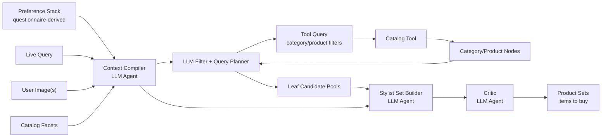
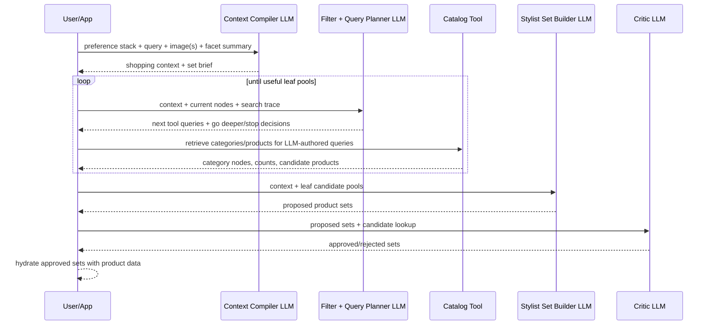
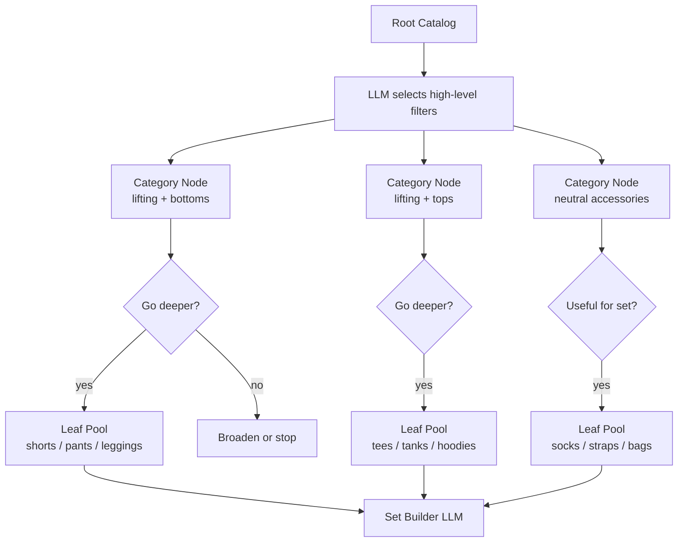
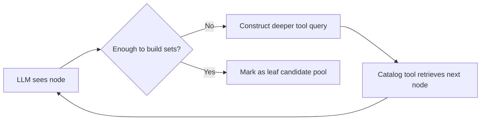
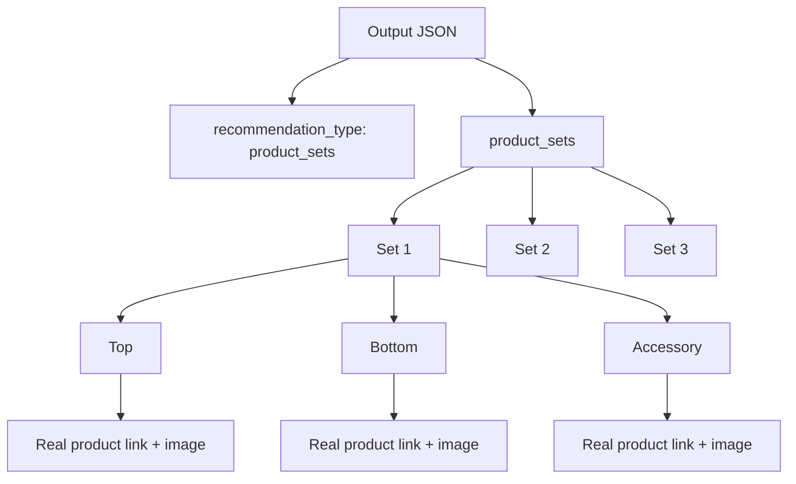
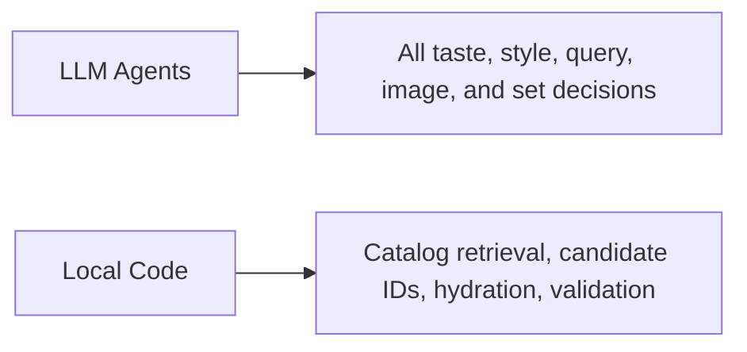

# Agentic Product-Set Recommender

## Flow



## Agent Roles

| Agent | Decides | Does Not Do |
|---|---|---|
| Context Compiler | user goal, image meaning, set shape | pick products |
| LLM Filter + Query Planner | which catalog nodes to enter, when to go deeper, when to stop | fetch products directly |
| Catalog Tool | returns categories, counts, and product candidates for an LLM-authored query | interpret style |
| Set Builder | product combinations to buy from leaf pools | invent items |
| Critic | approve/reject sets | add new products |

## Runtime Loop



## Catalog Traversal



## Tool Query Shape

```json
{
  "query_id": "q_003",
  "goal": "find bottoms for the lifting set",
  "filters": {
    "activity": ["lifting"],
    "category": ["shorts", "pants", "leggings"]
  },
  "exclude_filters": {},
  "return": "category_nodes_or_products",
  "why": "The set still needs a practical lower-body item."
}
```

## Leaf Rule



## Output Shape



## Final JSON Skeleton

```json
{
  "output_format_version": "agentic_product_set_recommender.v1",
  "recommendation_type": "product_sets",
  "product_sets": [
    {
      "set_id": "set_001",
      "set_name": "Minimal Leg Day Set",
      "items": [
        {
          "role": "top",
          "why_this_item": "...",
          "product": {
            "product_name": "...",
            "image_url": "...",
            "product_link": "..."
          }
        }
      ],
      "why_this_set": "...",
      "preference_alignment": ["..."],
      "query_alignment": ["..."],
      "visual_alignment": ["..."],
      "tradeoffs": [],
      "confidence_score": 0.91
    }
  ]
}
```

## Rule



No hardcoded query breakdown. No hardcoded style rules. No individual-product recommendation as the final answer.
